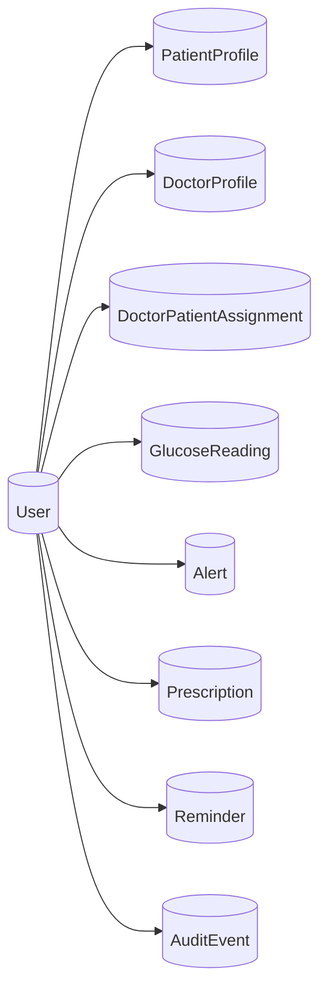

# GlucoCare+ Flowcharts

## 1) Auth + Routing Flow

```mermaid
flowchart TD
    A[User opens app] --> B{Has account?}
    B -- No --> C[Register page]
    B -- Yes --> D[Login page]

    C --> C1[POST /api/auth action=register]
    C1 --> C2[Validate common + role-specific fields]
    C2 --> C3[Create user + profile rows]
    C3 --> C4[Issue JWT + set auth cookies]
    C4 --> E{Role}

    D --> D1[POST /api/auth action=login]
    D1 --> D2[Verify password + isActive]
    D2 --> D3[Issue JWT + set auth cookies]
    D3 --> E

    E -- patient --> P[/dashboard/patient]
    E -- doctor --> R[/dashboard/doctor]
    E -- admin --> M[/admin]

    subgraph Guard[middleware.ts]
      G1[Check protected routes]
      G2[Read/validate token + role]
      G3[Redirect to correct dashboard or /login]
      G1 --> G2 --> G3
    end

    P --> G1
    R --> G1
    M --> G1

    S1[First-time setup optional] --> S2[POST /api/auth/bootstrap-admin]
    S2 --> M
```

## 2) Patient Dashboard Flow

```mermaid
flowchart TD
    P0[Patient dashboard load] --> P1[GET /api/patient/readings?range=7d|30d]
    P0 --> P2[GET /api/patient/reminders]
    P0 --> P3[GET /api/audit/activity]

    P4[Add glucose reading] --> P5[POST /api/patient/readings]
    P5 --> P6[analyzeGlucoseReadings]
    P6 --> P7[Deactivate old alerts]
    P7 --> P8[Create new alerts if needed]
    P8 --> P9[Return risk + alerts + reading]
    P9 --> P1

    P10[Mark reminder done/undone] --> P11[PATCH /api/patient/reminders/[reminderId]]
    P11 --> P2
    P11 --> P3
```

## 3) Doctor + Admin Flow

```mermaid
flowchart TD
    D0[Doctor dashboard load] --> D1[GET /api/doctor/patients]
    D0 --> D2[GET /api/audit/activity]

    D1 --> DX{DoctorPatientAssignment exists?}
    DX -- No --> DY[Show: no assigned patients]
    DX -- Yes --> DZ[Show assigned patient names]

    D3[Assign patient by email] --> D4[POST /api/doctor/assignments]
    D4 --> D1

    D5[Open patient details] --> D6[GET /api/doctor/patients/[patientId]]
    D6 --> D7[Verify patient belongs to doctor]

    D8[Create prescription] --> D9[POST /api/doctor/prescriptions]
    D9 --> D6

    D10[Create reminder] --> D11[POST /api/doctor/reminders]
    D11 --> D6

    A0[Admin dashboard load] --> A1[GET /api/admin/users]
    A0 --> A2[GET /api/audit/activity]
    A3[Enable/disable user] --> A4[PATCH /api/admin/users/[userId]/status]
    A4 --> A1
```

## 4) Data Model Overview



## Key behavior to remember

- Doctor dashboard shows only **assigned** patients (`DoctorPatientAssignment`), not all registered patients.
- Registering a doctor and patient does not auto-link them.
- Use `Assign by patient email` in doctor dashboard to make patient names appear.
